

  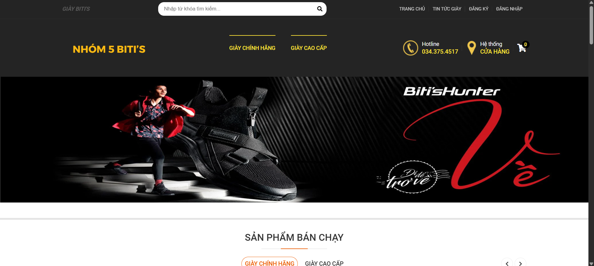
  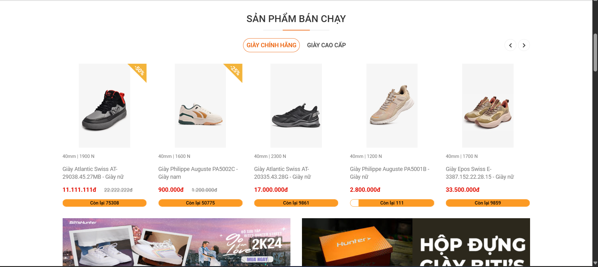
  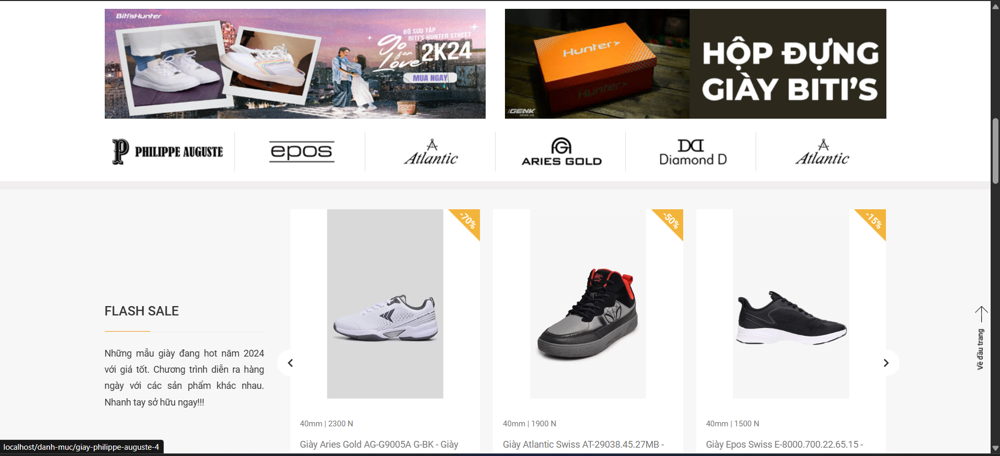

  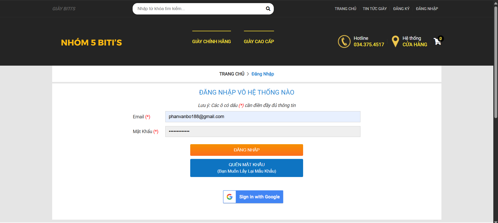
  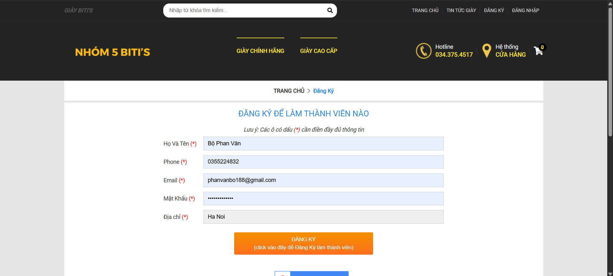
  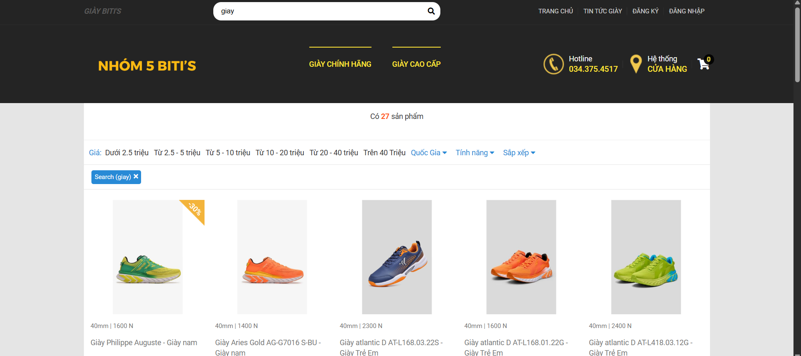

  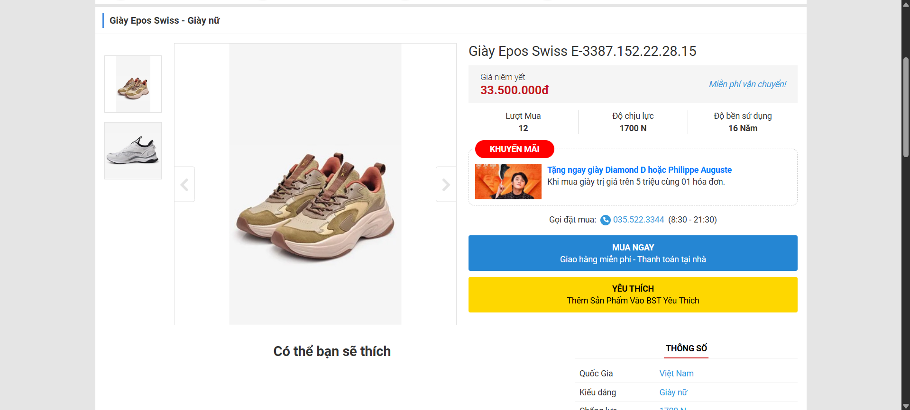
  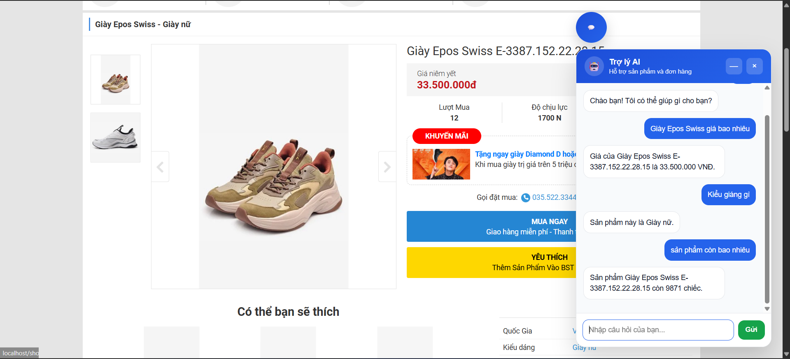
  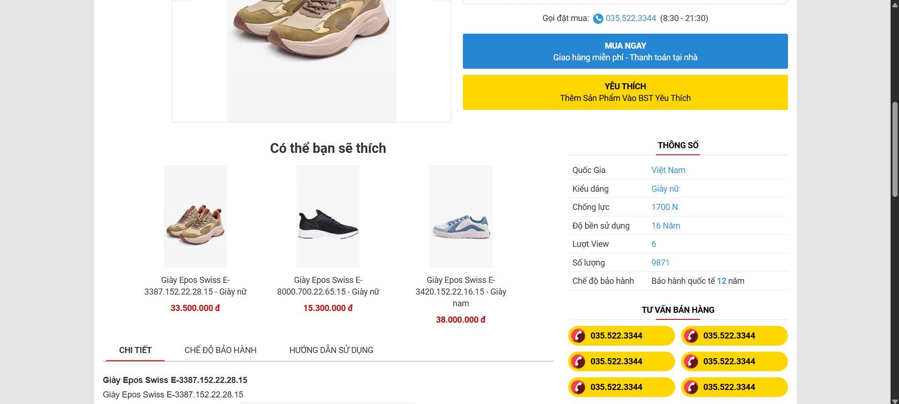

  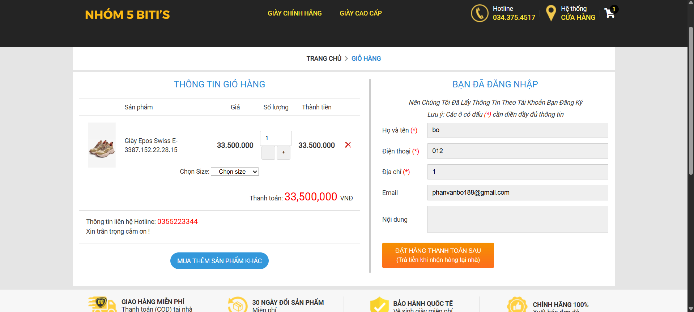
  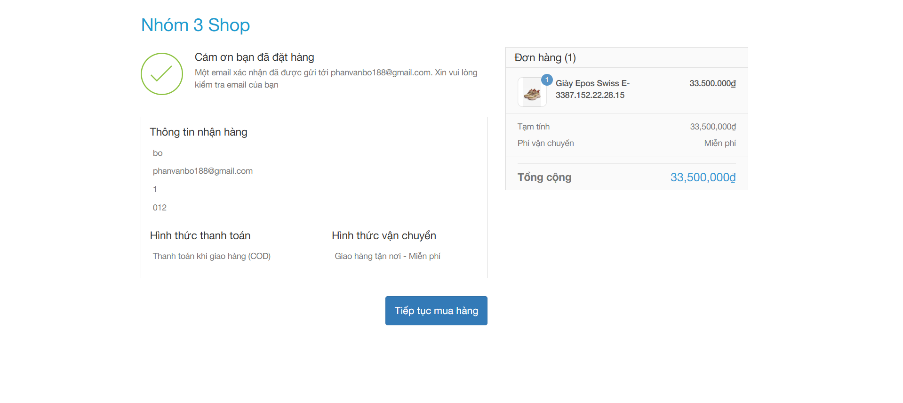
  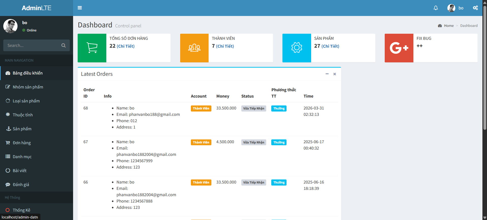

  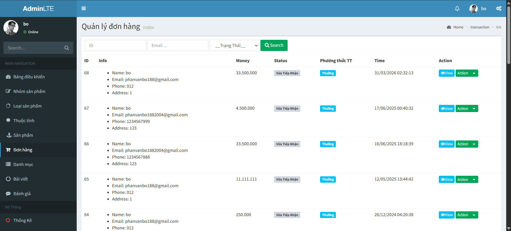
  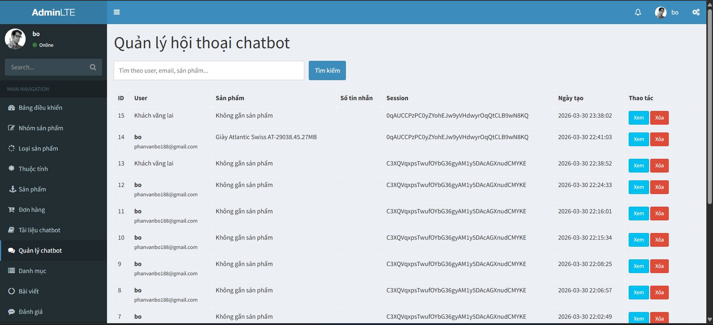
  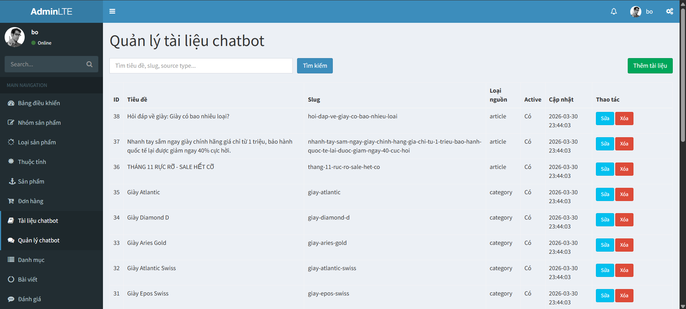

# Biti's AI-Powered E-Commerce Platform

## Overview

This project is an AI-driven e-commerce platform developed for selling Biti’s branded shoes. Unlike traditional online shopping systems, this platform places the **AI Chatbot at the core of the user experience**, transforming how customers interact with products, services, and the brand.

The chatbot acts as a virtual assistant that supports users throughout the entire shopping journey — from product discovery to post-purchase support — providing fast, accurate, and contextual responses in real time.

---

## AI Chatbot – Core System

The AI Chatbot is the central component of the platform, designed to simulate human-like interaction and provide intelligent assistance across all aspects of the website.

  

### Key Capabilities

- **Product Consultation**  
  The chatbot can recommend suitable shoes based on user needs such as style, size, price range, or intended use (e.g., sports, casual, office). It helps users quickly find the most relevant products without manual searching.

- **Customer Support Automation**  
  Users can ask questions about products, promotions, policies, or store information, and receive immediate responses without waiting for human support.

- **Order Assistance**  
  The chatbot can guide users through the ordering process, explain payment methods, and provide updates about order status.

- **Context-Aware Interaction**  
  The system understands user intent and maintains conversation context, enabling more natural and effective communication.

- **24/7 Availability**  
  The chatbot operates continuously, ensuring that users always receive support regardless of time or workload.

### Business Impact

By integrating AI into the core workflow, the system significantly:
- Reduces customer support workload  
- Improves user engagement and satisfaction  
- Increases conversion rates through personalized recommendations  
- Enhances overall shopping efficiency  

---

## Supporting Features

While the AI Chatbot is the primary focus, the platform also includes essential e-commerce functionalities to ensure a complete and reliable system.

### User Account Management

Users can register, log in, and manage their personal information, including updating profiles and recovering passwords securely.

### Product Catalog

The system provides a structured product catalog with detailed information such as images, descriptions, pricing, sizes, and stock availability. Basic search and filtering features are also supported.

### Shopping Cart & Checkout

Users can add products to a cart, modify quantities, and complete purchases using multiple payment methods, including online payment and cash on delivery.

### Order Tracking

Customers can monitor their orders from confirmation to delivery, while administrators can manage and update order statuses.

### Content Management

Administrators can manage products, promotional content, and policies to keep the website updated and aligned with business strategies.

---

## Non-Functional Requirements

### Performance

The platform ensures fast response times, with page loading optimized to remain under 2 seconds under normal conditions. The system is capable of handling high traffic, especially during promotional events.

### Scalability

The architecture is designed for scalability, allowing seamless integration of new features and support for a growing number of users.

### Security

All user data and transactions are protected through encryption and strict access control. The system includes protection mechanisms against common vulnerabilities such as SQL Injection, XSS, and DDoS attacks.

### Usability

The interface is clean, intuitive, and user-friendly, minimizing the number of steps required to complete actions such as searching, chatting, and purchasing.

### Data Reliability

Regular data backup mechanisms are implemented to ensure quick recovery in case of system failures.

### Legal Compliance

The system complies with e-commerce regulations and data protection laws applicable in the target market.

## Vision

This platform aims to redefine online shopping by placing **AI at the center of user interaction**. Instead of navigating complex interfaces, users can simply communicate with the system naturally and receive intelligent guidance.

The long-term vision is to evolve the chatbot into a fully personalized shopping assistant that understands user behavior, preferences, and intent — delivering a smarter, faster, and more human-like digital shopping experience.

---
---
---

## About Laravel

Laravel is a web application framework with expressive, elegant syntax. We believe development must be an enjoyable and creative experience to be truly fulfilling. Laravel takes the pain out of development by easing common tasks used in many web projects, such as:

- [Simple, fast routing engine](https://laravel.com/docs/routing).
- [Powerful dependency injection container](https://laravel.com/docs/container).
- Multiple back-ends for [session](https://laravel.com/docs/session) and [cache](https://laravel.com/docs/cache) storage.
- Expressive, intuitive [database ORM](https://laravel.com/docs/eloquent).
- Database agnostic [schema migrations](https://laravel.com/docs/migrations).
- [Robust background job processing](https://laravel.com/docs/queues).
- [Real-time event broadcasting](https://laravel.com/docs/broadcasting).

Laravel is accessible, powerful, and provides tools required for large, robust applications.

## Learning Laravel

Laravel has the most extensive and thorough [documentation](https://laravel.com/docs) and video tutorial library of all modern web application frameworks, making it a breeze to get started with the framework.

You may also try the [Laravel Bootcamp](https://bootcamp.laravel.com), where you will be guided through building a modern Laravel application from scratch.

If you don't feel like reading, [Laracasts](https://laracasts.com) can help. Laracasts contains over 2000 video tutorials on a range of topics including Laravel, modern PHP, unit testing, and JavaScript. Boost your skills by digging into our comprehensive video library.

## Laravel Sponsors

We would like to extend our thanks to the following sponsors for funding Laravel development. If you are interested in becoming a sponsor, please visit the Laravel [Patreon page](https://patreon.com/taylorotwell).

### Premium Partners

- **[Vehikl](https://vehikl.com/)**
- **[Tighten Co.](https://tighten.co)**
- **[Kirschbaum Development Group](https://kirschbaumdevelopment.com)**
- **[64 Robots](https://64robots.com)**
- **[Cubet Techno Labs](https://cubettech.com)**
- **[Cyber-Duck](https://cyber-duck.co.uk)**
- **[Many](https://www.many.co.uk)**
- **[Webdock, Fast VPS Hosting](https://www.webdock.io/en)**
- **[DevSquad](https://devsquad.com)**
- **[Curotec](https://www.curotec.com/services/technologies/laravel/)**
- **[OP.GG](https://op.gg)**
- **[WebReinvent](https://webreinvent.com/?utm_source=laravel&utm_medium=github&utm_campaign=patreon-sponsors)**
- **[Lendio](https://lendio.com)**

## Contributing

Thank you for considering contributing to the Laravel framework! The contribution guide can be found in the [Laravel documentation](https://laravel.com/docs/contributions).

## Code of Conduct

In order to ensure that the Laravel community is welcoming to all, please review and abide by the [Code of Conduct](https://laravel.com/docs/contributions#code-of-conduct).

## Security Vulnerabilities

If you discover a security vulnerability within Laravel, please send an e-mail to Taylor Otwell via [taylor@laravel.com](mailto:taylor@laravel.com). All security vulnerabilities will be promptly addressed.

## License

The Laravel framework is open-sourced software licensed under the [MIT license](https://opensource.org/licenses/MIT).

  

  
  
  

